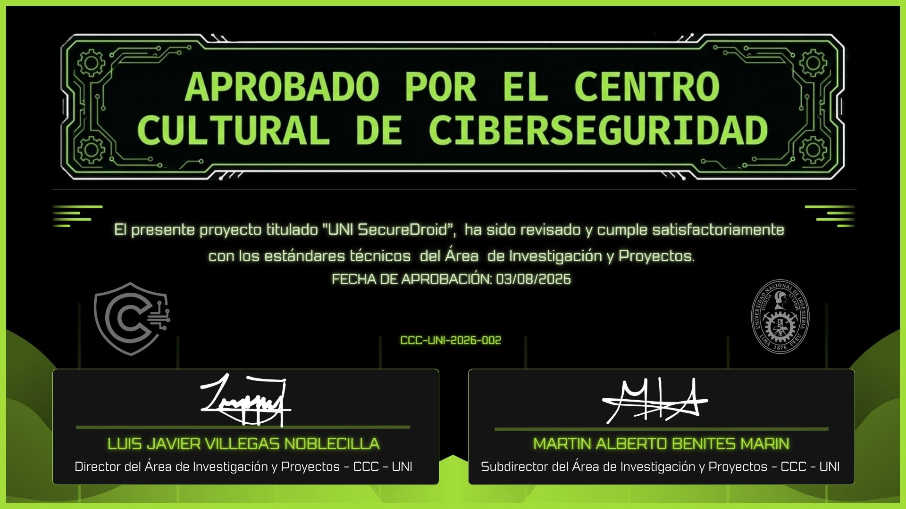

# UNI-Secure-Droid

## Tabla de contenidos

- [Descripción](#descripción)
- [Características](#características)
- [Requisitos](#requisitos)
- [Instalación rápida](#instalación-rápida)
- [Configuración (API Key)](#configuración-api-key)
- [Uso en Android Studio](#uso-en-android-studio)
- [Imagen Docker](#imagen-docker)
- [Contribuir](#contribuir)
- [Integrantes](#integrantes)

---

## Descripción

UNI-Secure-Droid es un proyecto para la detección de aplicaciones Android maliciosas utilizando análisis estático y dinámico junto con modelos de aprendizaje automático.

<p align="center">
  
</p>
<br>

## Características

- Análisis estático de APKs
- Recolección de métricas dinámicas en emulador o dispositivo
- Integración para enriquecer conjuntos de características destinados a modelos de ML

## Requisitos

- **Android Studio:** Koala, Jellyfish o superior
- **Android SDK:** minSdk 24, targetSdk 34
- **Java JDK:** 17 (para Gradle)
- **Python 3** (si se usan scripts auxiliares)
- Conexión a Internet para dependencias y APIs externas (p. ej. VirusTotal)

## Instalación rápida

1. Clona el repositorio:

```bash
git clone https://github.com/TU_USUARIO/UNI-SecureDroid.git
cd UNI-SecureDroid
```

2. (Opcional) Usar la imagen Docker pública:

```bash
docker pull principecoder/uni-secure-droid
```

3. Abre el proyecto en Android Studio.

## Configuración (API Key)

La API Key de VirusTotal NO debe incluirse en el repositorio.

1. Crea (o edita) `local.properties` en la raíz del proyecto.
2. Añade la línea (reemplaza por tu clave real):

```properties
VIRUSTOTAL_KEY=TU_CLAVE_DE_VIRUSTOTAL
```

3. Asegúrate de que `local.properties` está en `.gitignore`.

## Uso en Android Studio

1. Abre Android Studio → `Open` → selecciona la carpeta del proyecto.
2. Espera a que Gradle sincronice e indexe.
3. Rellena `VIRUSTOTAL_KEY` en `local.properties`.
4. Pulsa `Sync Project with Gradle Files`.
5. Si hay errores de compilación (p. ej. BuildConfig en rojo), ve a `Build` → `Make Project`.
6. Conecta un dispositivo o inicia un emulador y pulsa `Run` (▶).

## Imagen Docker

La imagen pública contiene Ubuntu, Python y OpenJDK; revisa la página en Docker Hub:

https://hub.docker.com/r/principecoder/uni-secure-droid

## Contribuir

- Abre un *issue* para discutir mejoras o bugs.
- Haz un fork y envía un *pull request* con tus cambios.

Incluye descripciones claras y pruebas mínimas cuando sea posible.

## Integrantes

- Torres Reyes Sebastian David
- Smith Tay Carlos Alejandro
- Benites Marín Martín Alberto
- Príncipe Ostos Anghelo Kenedy

